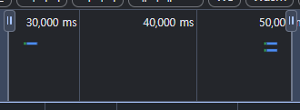
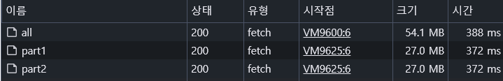

# BMP SPLITTER

---
### 목적
대용량 Image를 빠르게 전송하여 실시간으로 렌더링하기 위해서 제작

웹 방문자가 빠르게 이미지를 확인할 수 있도록 하기 위함

---
### 전달 방식
- **이미지 전송 최적화**: 이미지를 작은 청크로 나누어 병렬로 전송합니다.
- **빠른 렌더링**: 데이터를 받는 대로 화면에 렌더링하여 이미지를 빠르게 렌더링합니다.

---
### 적용
> 
> 
> 

용량이 클수록 유의미한 결과를 얻을 수 있습니다.

### 기술
- 이미지 포맷: BMP 사용 (비손실 압축, 데이터 분할 가능)
- 백엔드: Spring Boot (이미지 분할 및 병렬 전송)
- 프론트엔드: JavaScript (이미지 데이터 받아 화면에 렌더링)

---
### 동작 방식
1. BMP 이미지를 DB에서 가져와 N개의 청크로 분할.
2. 분할된 데이터를 병렬로 전송
3. 데이터를 받은 순서대로 렌더링.
4. 원본 이미지를 재구성하여 최종 렌더링.

---

# 알고리즘

## 배경지식

### BMP 파일 분석
```
<BMP 파일 헤더>
42 4d  // BMP 파일
76 00 00 00  // 파일 크기 
00 00 00 00 // 예약값 = 0
36 00 00 00 // 픽셀 데이터 시작 위치 

<DIB 헤더>
28 00 00 00 // DIB 헤더 크기
04 00 00 00 // 너비
04 00 00 00 // 높이
01 00 // 1 (항상) 
18 00 // 색상 비트 깊이
00 00 00 00 // 압축 없음
40 00 00 00 // 이미지 크기
13 0b 00 00 // 가로 해상도
13 0b 00 00 // 세로 해상도
00 00 00 00 // 색상 테이블
00 00 00 00 // 중요한 색상

<픽셀 데이터>
0f 31 54 63 1a 7b...
```

렌더링에 결정적으로 영향을 주는 요소
- 높이
- 너비
- 픽셀 데이터
- 비트깊이

청크를 분할할때, `높이`와 `넓이`는 Image가 깨지는데 직접적인 영향을 주므로 상세하게 split 한다.

---
## 백엔드

### 청크 분할
※ `색상비트의 깊이`가 0x18 이므로 3Byte가 픽셀임을 감안하여 높이와 넓이를 계산한다.

여러 크기로 분할하여 달라진 높이로 수정한 `헤더 데이터 + 분할한 픽셀 데이터` 로 작은 BMP데이터 구성

### 이미지 전송 
분할한 청크 데이터를 API에서 전송

---
### REST API - 이미지 분할 전송
> GET /api/image/{name}/{partN}

이미지 파일을 부분적으로 전송하는 API

URL param
- {name}: 요청한 BMP의 파일 이름
- {partN}: 반환할 이미지의 청크 번호 (예: part1, part2)

응답
- 반환되는 데이터: BMP 이미지 part
설명

---
## 프론트엔드

### 병렬 request
프론트엔드에서 분할된 파일을 병렬로 REST API로 GET요청

### 